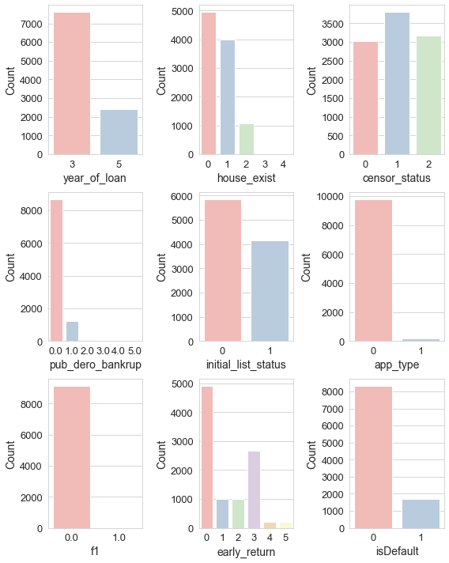
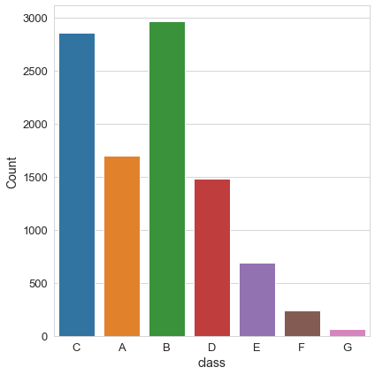
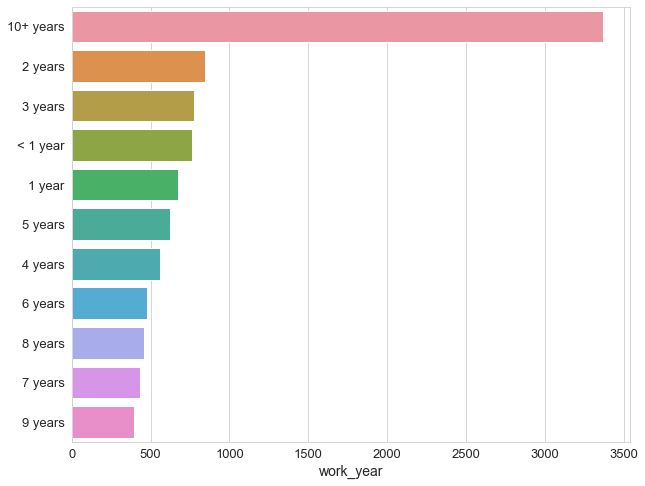
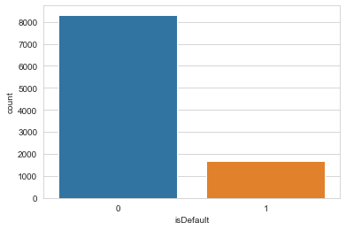
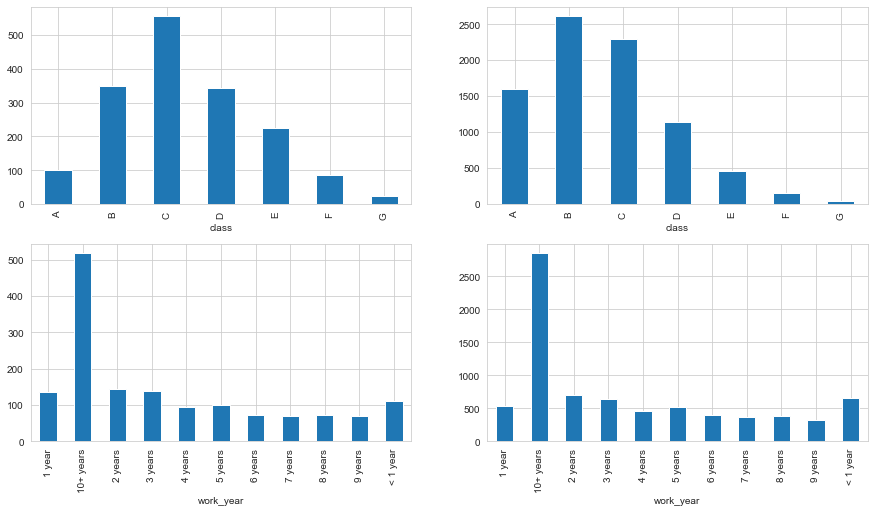
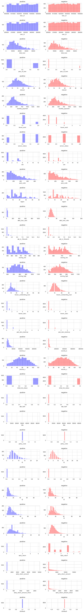
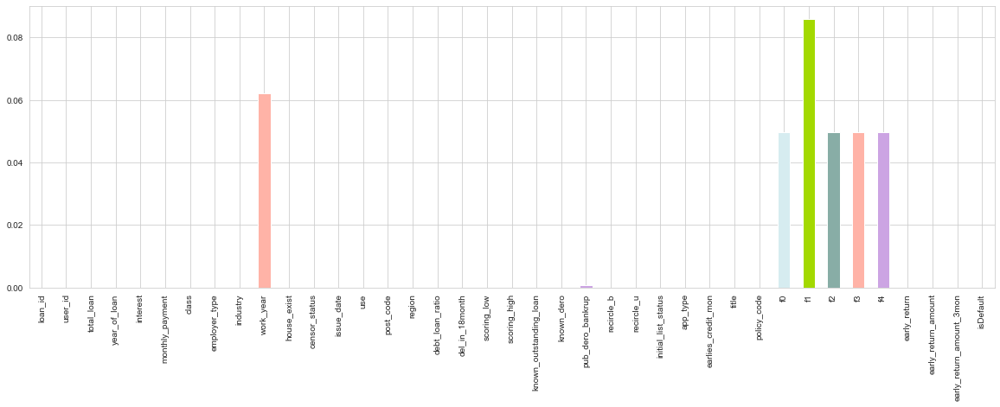
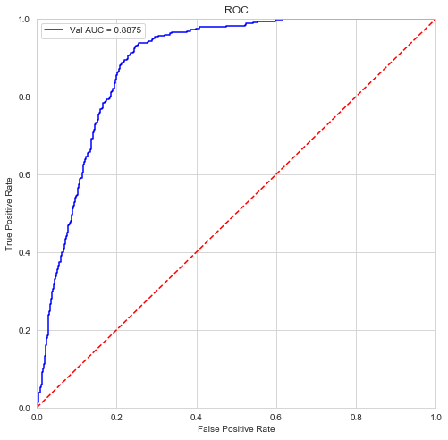
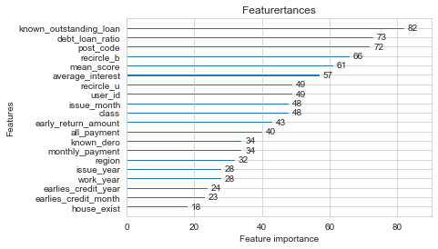
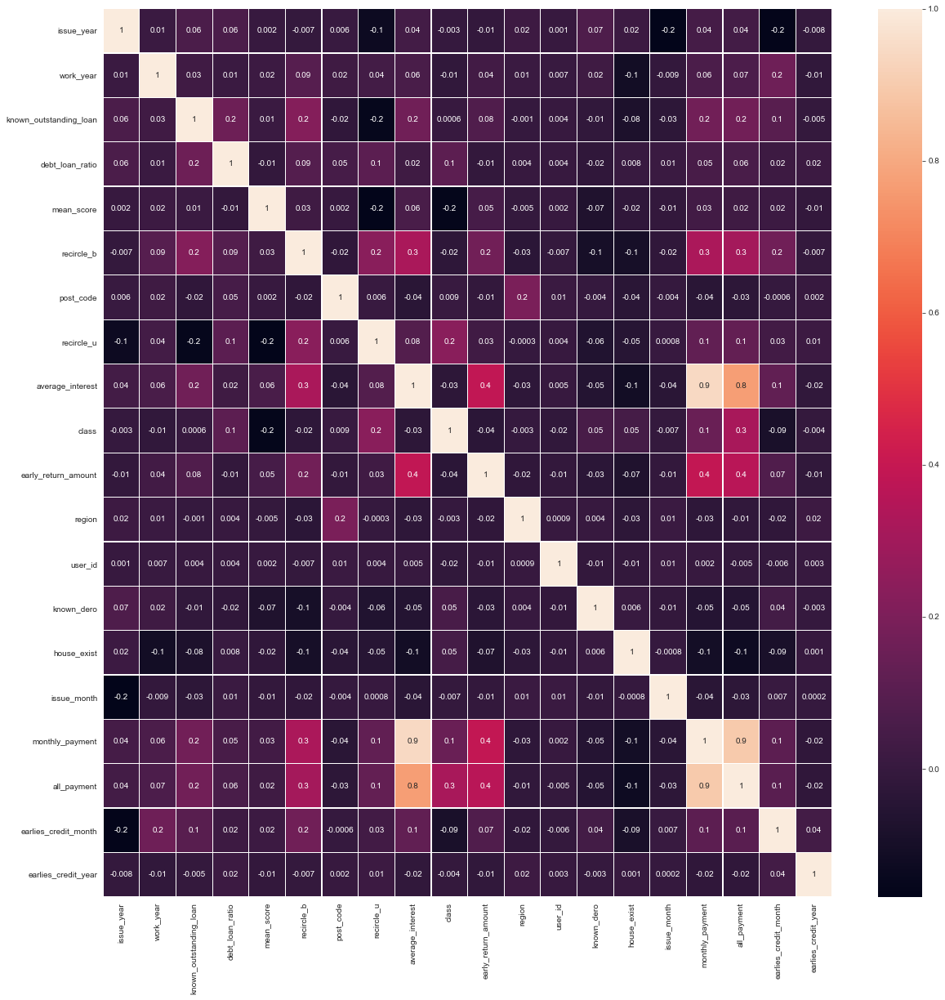

```python
import pandas as pd 
import numpy as np
```


```python
train = pd.read_csv(r'C:\Users\asus\Desktop\机器学习\个贷违约预测-CCF大数据与计算智能大赛2021\train_public.csv')
test = pd.read_csv(r'C:\Users\asus\Desktop\机器学习\个贷违约预测-CCF大数据与计算智能大赛2021\test_public.csv')
```


```python
train.head()
```


<div>
<style scoped>
    .dataframe tbody tr th:only-of-type {
        vertical-align: middle;
    }

    .dataframe tbody tr th {
        vertical-align: top;
    }

    .dataframe thead th {
        text-align: right;
    }
</style>
<table border="1" class="dataframe">
  <thead>
    <tr style="text-align: right;">
      <th></th>
      <th>loan_id</th>
      <th>user_id</th>
      <th>total_loan</th>
      <th>year_of_loan</th>
      <th>interest</th>
      <th>monthly_payment</th>
      <th>class</th>
      <th>employer_type</th>
      <th>industry</th>
      <th>work_year</th>
      <th>...</th>
      <th>policy_code</th>
      <th>f0</th>
      <th>f1</th>
      <th>f2</th>
      <th>f3</th>
      <th>f4</th>
      <th>early_return</th>
      <th>early_return_amount</th>
      <th>early_return_amount_3mon</th>
      <th>isDefault</th>
    </tr>
  </thead>
  <tbody>
    <tr>
      <th>0</th>
      <td>1040418</td>
      <td>240418</td>
      <td>31818.18182</td>
      <td>3</td>
      <td>11.466</td>
      <td>1174.91</td>
      <td>C</td>
      <td>政府机构</td>
      <td>金融业</td>
      <td>3 years</td>
      <td>...</td>
      <td>1</td>
      <td>1.0</td>
      <td>0.0</td>
      <td>4.0</td>
      <td>5.0</td>
      <td>4.0</td>
      <td>3</td>
      <td>9927</td>
      <td>0.0</td>
      <td>0</td>
    </tr>
    <tr>
      <th>1</th>
      <td>1025197</td>
      <td>225197</td>
      <td>28000.00000</td>
      <td>5</td>
      <td>16.841</td>
      <td>670.69</td>
      <td>C</td>
      <td>政府机构</td>
      <td>金融业</td>
      <td>10+ years</td>
      <td>...</td>
      <td>1</td>
      <td>7.0</td>
      <td>0.0</td>
      <td>4.0</td>
      <td>45.0</td>
      <td>22.0</td>
      <td>0</td>
      <td>0</td>
      <td>0.0</td>
      <td>0</td>
    </tr>
    <tr>
      <th>2</th>
      <td>1009360</td>
      <td>209360</td>
      <td>17272.72727</td>
      <td>3</td>
      <td>8.900</td>
      <td>603.32</td>
      <td>A</td>
      <td>政府机构</td>
      <td>公共服务、社会组织</td>
      <td>10+ years</td>
      <td>...</td>
      <td>1</td>
      <td>6.0</td>
      <td>0.0</td>
      <td>6.0</td>
      <td>28.0</td>
      <td>19.0</td>
      <td>0</td>
      <td>0</td>
      <td>0.0</td>
      <td>0</td>
    </tr>
    <tr>
      <th>3</th>
      <td>1039708</td>
      <td>239708</td>
      <td>20000.00000</td>
      <td>3</td>
      <td>4.788</td>
      <td>602.30</td>
      <td>A</td>
      <td>世界五百强</td>
      <td>文化和体育业</td>
      <td>6 years</td>
      <td>...</td>
      <td>1</td>
      <td>5.0</td>
      <td>0.0</td>
      <td>10.0</td>
      <td>15.0</td>
      <td>9.0</td>
      <td>0</td>
      <td>0</td>
      <td>0.0</td>
      <td>0</td>
    </tr>
    <tr>
      <th>4</th>
      <td>1027483</td>
      <td>227483</td>
      <td>15272.72727</td>
      <td>3</td>
      <td>12.790</td>
      <td>470.31</td>
      <td>C</td>
      <td>政府机构</td>
      <td>信息传输、软件和信息技术服务业</td>
      <td>&lt; 1 year</td>
      <td>...</td>
      <td>1</td>
      <td>10.0</td>
      <td>0.0</td>
      <td>6.0</td>
      <td>15.0</td>
      <td>4.0</td>
      <td>0</td>
      <td>0</td>
      <td>0.0</td>
      <td>0</td>
    </tr>
  </tbody>
</table>
<p>5 rows × 39 columns</p>
</div>


```python
train.shape

```


    (10000, 39)


```python
train.info()
```

    <class 'pandas.core.frame.DataFrame'>
    RangeIndex: 10000 entries, 0 to 9999
    Data columns (total 39 columns):
     #   Column                    Non-Null Count  Dtype  
    ---  ------                    --------------  -----  
     0   loan_id                   10000 non-null  int64  
     1   user_id                   10000 non-null  int64  
     2   total_loan                10000 non-null  float64
     3   year_of_loan              10000 non-null  int64  
     4   interest                  10000 non-null  float64
     5   monthly_payment           10000 non-null  float64
     6   class                     10000 non-null  object 
     7   employer_type             10000 non-null  object 
     8   industry                  10000 non-null  object 
     9   work_year                 9378 non-null   object 
     10  house_exist               10000 non-null  int64  
     11  censor_status             10000 non-null  int64  
     12  issue_date                10000 non-null  object 
     13  use                       10000 non-null  int64  
     14  post_code                 10000 non-null  int64  
     15  region                    10000 non-null  int64  
     16  debt_loan_ratio           10000 non-null  float64
     17  del_in_18month            10000 non-null  int64  
     18  scoring_low               10000 non-null  float64
     19  scoring_high              10000 non-null  float64
     20  known_outstanding_loan    10000 non-null  int64  
     21  known_dero                10000 non-null  int64  
     22  pub_dero_bankrup          9993 non-null   float64
     23  recircle_b                10000 non-null  float64
     24  recircle_u                10000 non-null  float64
     25  initial_list_status       10000 non-null  int64  
     26  app_type                  10000 non-null  int64  
     27  earlies_credit_mon        10000 non-null  object 
     28  title                     10000 non-null  int64  
     29  policy_code               10000 non-null  int64  
     30  f0                        9502 non-null   float64
     31  f1                        9142 non-null   float64
     32  f2                        9502 non-null   float64
     33  f3                        9502 non-null   float64
     34  f4                        9502 non-null   float64
     35  early_return              10000 non-null  int64  
     36  early_return_amount       10000 non-null  int64  
     37  early_return_amount_3mon  10000 non-null  float64
     38  isDefault                 10000 non-null  int64  
    dtypes: float64(15), int64(18), object(6)
    memory usage: 3.0+ MB
    

# 描述性统计
	加深对数据分布、数据结构等的理解
	看一下数据特征之间的两两关联关系
	数据中空值的个数、0的个数、正值或负值的个数，
	以及均值、方差、最小值、最大值、偏度、峰度等。


```python
train.describe().T
```


<div>
<style scoped>
    .dataframe tbody tr th:only-of-type {
        vertical-align: middle;
    }

    .dataframe tbody tr th {
        vertical-align: top;
    }

    .dataframe thead th {
        text-align: right;
    }
</style>
<table border="1" class="dataframe">
  <thead>
    <tr style="text-align: right;">
      <th></th>
      <th>count</th>
      <th>mean</th>
      <th>std</th>
      <th>min</th>
      <th>25%</th>
      <th>50%</th>
      <th>75%</th>
      <th>max</th>
    </tr>
  </thead>
  <tbody>
    <tr>
      <th>loan_id</th>
      <td>10000.0</td>
      <td>1.025210e+06</td>
      <td>14386.820956</td>
      <td>1.000008e+06</td>
      <td>1.012973e+06</td>
      <td>1.025276e+06</td>
      <td>1.037694e+06</td>
      <td>1.049997e+06</td>
    </tr>
    <tr>
      <th>user_id</th>
      <td>10000.0</td>
      <td>2.252096e+05</td>
      <td>14386.820956</td>
      <td>2.000080e+05</td>
      <td>2.129732e+05</td>
      <td>2.252765e+05</td>
      <td>2.376945e+05</td>
      <td>2.499970e+05</td>
    </tr>
    <tr>
      <th>total_loan</th>
      <td>10000.0</td>
      <td>1.440213e+04</td>
      <td>8953.946807</td>
      <td>8.181818e+02</td>
      <td>7.500000e+03</td>
      <td>1.227273e+04</td>
      <td>1.963636e+04</td>
      <td>4.727273e+04</td>
    </tr>
    <tr>
      <th>year_of_loan</th>
      <td>10000.0</td>
      <td>3.479600e+00</td>
      <td>0.853965</td>
      <td>3.000000e+00</td>
      <td>3.000000e+00</td>
      <td>3.000000e+00</td>
      <td>3.000000e+00</td>
      <td>5.000000e+00</td>
    </tr>
    <tr>
      <th>interest</th>
      <td>10000.0</td>
      <td>1.322278e+01</td>
      <td>4.875755</td>
      <td>4.779000e+00</td>
      <td>9.702000e+00</td>
      <td>1.263900e+01</td>
      <td>1.598550e+01</td>
      <td>3.397900e+01</td>
    </tr>
    <tr>
      <th>monthly_payment</th>
      <td>10000.0</td>
      <td>4.369604e+02</td>
      <td>261.754396</td>
      <td>3.044000e+01</td>
      <td>2.488200e+02</td>
      <td>3.715250e+02</td>
      <td>5.738300e+02</td>
      <td>1.503890e+03</td>
    </tr>
    <tr>
      <th>house_exist</th>
      <td>10000.0</td>
      <td>6.122000e-01</td>
      <td>0.672203</td>
      <td>0.000000e+00</td>
      <td>0.000000e+00</td>
      <td>1.000000e+00</td>
      <td>1.000000e+00</td>
      <td>4.000000e+00</td>
    </tr>
    <tr>
      <th>censor_status</th>
      <td>10000.0</td>
      <td>1.014600e+00</td>
      <td>0.787686</td>
      <td>0.000000e+00</td>
      <td>0.000000e+00</td>
      <td>1.000000e+00</td>
      <td>2.000000e+00</td>
      <td>2.000000e+00</td>
    </tr>
    <tr>
      <th>use</th>
      <td>10000.0</td>
      <td>1.762600e+00</td>
      <td>2.392031</td>
      <td>0.000000e+00</td>
      <td>0.000000e+00</td>
      <td>0.000000e+00</td>
      <td>4.000000e+00</td>
      <td>1.300000e+01</td>
    </tr>
    <tr>
      <th>post_code</th>
      <td>10000.0</td>
      <td>2.575191e+02</td>
      <td>201.351778</td>
      <td>0.000000e+00</td>
      <td>9.900000e+01</td>
      <td>1.970000e+02</td>
      <td>3.900000e+02</td>
      <td>9.010000e+02</td>
    </tr>
    <tr>
      <th>region</th>
      <td>10000.0</td>
      <td>1.631990e+01</td>
      <td>11.019097</td>
      <td>0.000000e+00</td>
      <td>8.000000e+00</td>
      <td>1.400000e+01</td>
      <td>2.200000e+01</td>
      <td>4.900000e+01</td>
    </tr>
    <tr>
      <th>debt_loan_ratio</th>
      <td>10000.0</td>
      <td>1.753217e+01</td>
      <td>14.218509</td>
      <td>0.000000e+00</td>
      <td>1.115795e+01</td>
      <td>1.665227e+01</td>
      <td>2.278159e+01</td>
      <td>9.990000e+02</td>
    </tr>
    <tr>
      <th>del_in_18month</th>
      <td>10000.0</td>
      <td>3.116000e-01</td>
      <td>0.872457</td>
      <td>0.000000e+00</td>
      <td>0.000000e+00</td>
      <td>0.000000e+00</td>
      <td>0.000000e+00</td>
      <td>1.500000e+01</td>
    </tr>
    <tr>
      <th>scoring_low</th>
      <td>10000.0</td>
      <td>6.641156e+02</td>
      <td>77.040511</td>
      <td>5.400000e+02</td>
      <td>6.013636e+02</td>
      <td>6.650000e+02</td>
      <td>7.254545e+02</td>
      <td>9.109091e+02</td>
    </tr>
    <tr>
      <th>scoring_high</th>
      <td>10000.0</td>
      <td>7.744483e+02</td>
      <td>99.174427</td>
      <td>5.850000e+02</td>
      <td>7.000000e+02</td>
      <td>7.727273e+02</td>
      <td>8.450000e+02</td>
      <td>1.131818e+03</td>
    </tr>
    <tr>
      <th>known_outstanding_loan</th>
      <td>10000.0</td>
      <td>1.164500e+01</td>
      <td>5.500745</td>
      <td>1.000000e+00</td>
      <td>8.000000e+00</td>
      <td>1.100000e+01</td>
      <td>1.400000e+01</td>
      <td>5.900000e+01</td>
    </tr>
    <tr>
      <th>known_dero</th>
      <td>10000.0</td>
      <td>2.264000e-01</td>
      <td>0.607931</td>
      <td>0.000000e+00</td>
      <td>0.000000e+00</td>
      <td>0.000000e+00</td>
      <td>0.000000e+00</td>
      <td>1.200000e+01</td>
    </tr>
    <tr>
      <th>pub_dero_bankrup</th>
      <td>9993.0</td>
      <td>1.389973e-01</td>
      <td>0.379089</td>
      <td>0.000000e+00</td>
      <td>0.000000e+00</td>
      <td>0.000000e+00</td>
      <td>0.000000e+00</td>
      <td>5.000000e+00</td>
    </tr>
    <tr>
      <th>recircle_b</th>
      <td>10000.0</td>
      <td>1.654830e+04</td>
      <td>21078.544232</td>
      <td>0.000000e+00</td>
      <td>6.189173e+03</td>
      <td>1.147608e+04</td>
      <td>2.038408e+04</td>
      <td>7.790210e+05</td>
    </tr>
    <tr>
      <th>recircle_u</th>
      <td>10000.0</td>
      <td>5.362262e+01</td>
      <td>26.023562</td>
      <td>0.000000e+00</td>
      <td>3.396923e+01</td>
      <td>5.328077e+01</td>
      <td>7.330962e+01</td>
      <td>1.206154e+02</td>
    </tr>
    <tr>
      <th>initial_list_status</th>
      <td>10000.0</td>
      <td>4.141000e-01</td>
      <td>0.492591</td>
      <td>0.000000e+00</td>
      <td>0.000000e+00</td>
      <td>0.000000e+00</td>
      <td>1.000000e+00</td>
      <td>1.000000e+00</td>
    </tr>
    <tr>
      <th>app_type</th>
      <td>10000.0</td>
      <td>2.000000e-02</td>
      <td>0.140007</td>
      <td>0.000000e+00</td>
      <td>0.000000e+00</td>
      <td>0.000000e+00</td>
      <td>0.000000e+00</td>
      <td>1.000000e+00</td>
    </tr>
    <tr>
      <th>title</th>
      <td>10000.0</td>
      <td>1.808202e+03</td>
      <td>8011.098270</td>
      <td>0.000000e+00</td>
      <td>0.000000e+00</td>
      <td>1.000000e+00</td>
      <td>5.000000e+00</td>
      <td>6.138700e+04</td>
    </tr>
    <tr>
      <th>policy_code</th>
      <td>10000.0</td>
      <td>1.000000e+00</td>
      <td>0.000000</td>
      <td>1.000000e+00</td>
      <td>1.000000e+00</td>
      <td>1.000000e+00</td>
      <td>1.000000e+00</td>
      <td>1.000000e+00</td>
    </tr>
    <tr>
      <th>f0</th>
      <td>9502.0</td>
      <td>5.690486e+00</td>
      <td>3.298546</td>
      <td>0.000000e+00</td>
      <td>3.000000e+00</td>
      <td>5.000000e+00</td>
      <td>7.000000e+00</td>
      <td>3.300000e+01</td>
    </tr>
    <tr>
      <th>f1</th>
      <td>9142.0</td>
      <td>1.422008e-03</td>
      <td>0.037685</td>
      <td>0.000000e+00</td>
      <td>0.000000e+00</td>
      <td>0.000000e+00</td>
      <td>0.000000e+00</td>
      <td>1.000000e+00</td>
    </tr>
    <tr>
      <th>f2</th>
      <td>9502.0</td>
      <td>8.467796e+00</td>
      <td>7.315953</td>
      <td>0.000000e+00</td>
      <td>4.000000e+00</td>
      <td>7.000000e+00</td>
      <td>1.100000e+01</td>
      <td>9.300000e+01</td>
    </tr>
    <tr>
      <th>f3</th>
      <td>9502.0</td>
      <td>1.465902e+01</td>
      <td>8.263954</td>
      <td>2.000000e+00</td>
      <td>9.000000e+00</td>
      <td>1.300000e+01</td>
      <td>1.900000e+01</td>
      <td>8.800000e+01</td>
    </tr>
    <tr>
      <th>f4</th>
      <td>9502.0</td>
      <td>8.098085e+00</td>
      <td>4.871797</td>
      <td>0.000000e+00</td>
      <td>5.000000e+00</td>
      <td>7.000000e+00</td>
      <td>1.100000e+01</td>
      <td>5.000000e+01</td>
    </tr>
    <tr>
      <th>early_return</th>
      <td>10000.0</td>
      <td>1.290600e+00</td>
      <td>1.449469</td>
      <td>0.000000e+00</td>
      <td>0.000000e+00</td>
      <td>1.000000e+00</td>
      <td>3.000000e+00</td>
      <td>5.000000e+00</td>
    </tr>
    <tr>
      <th>early_return_amount</th>
      <td>10000.0</td>
      <td>2.173916e+03</td>
      <td>3027.539977</td>
      <td>0.000000e+00</td>
      <td>0.000000e+00</td>
      <td>8.385000e+02</td>
      <td>3.354250e+03</td>
      <td>1.841300e+04</td>
    </tr>
    <tr>
      <th>early_return_amount_3mon</th>
      <td>10000.0</td>
      <td>3.352322e+02</td>
      <td>635.108825</td>
      <td>0.000000e+00</td>
      <td>0.000000e+00</td>
      <td>0.000000e+00</td>
      <td>4.136750e+02</td>
      <td>5.523900e+03</td>
    </tr>
    <tr>
      <th>isDefault</th>
      <td>10000.0</td>
      <td>1.683000e-01</td>
      <td>0.374151</td>
      <td>0.000000e+00</td>
      <td>0.000000e+00</td>
      <td>0.000000e+00</td>
      <td>0.000000e+00</td>
      <td>1.000000e+00</td>
    </tr>
  </tbody>
</table>
</div>


# 数据类型分析
数值类型（连续变量、离散型变量和单值变量）


```python
#选择数值类型
numerical_feature = list(train.select_dtypes(exclude=['object']))
numerical_feature
```


    ['loan_id',
     'user_id',
     'total_loan',
     'year_of_loan',
     'interest',
     'monthly_payment',
     'house_exist',
     'censor_status',
     'use',
     'post_code',
     'region',
     'debt_loan_ratio',
     'del_in_18month',
     'scoring_low',
     'scoring_high',
     'known_outstanding_loan',
     'known_dero',
     'pub_dero_bankrup',
     'recircle_b',
     'recircle_u',
     'initial_list_status',
     'app_type',
     'title',
     'policy_code',
     'f0',
     'f1',
     'f2',
     'f3',
     'f4',
     'early_return',
     'early_return_amount',
     'early_return_amount_3mon',
     'isDefault']


```python
len(numerical_feature)
```


    33


```python
# 连续型变量
serial_feature = []
# 离散型变量
discrete_feature = []
# 单值变量
unique_feature = []

for fea in numerical_feature:
    temp = train[fea].nunique()# 返回的是唯一值的个数
    if temp == 1:
        unique_feature.append(fea)
     # 自定义变量的值的取值个数小于10就为离散型变量    
    elif temp <= 10:
        discrete_feature.append(fea)
    else:
        serial_feature.append(fea)

```


```python
serial_feature
```


    ['loan_id',
     'user_id',
     'total_loan',
     'interest',
     'monthly_payment',
     'use',
     'post_code',
     'region',
     'debt_loan_ratio',
     'del_in_18month',
     'scoring_low',
     'scoring_high',
     'known_outstanding_loan',
     'known_dero',
     'recircle_b',
     'recircle_u',
     'title',
     'f0',
     'f2',
     'f3',
     'f4',
     'early_return_amount',
     'early_return_amount_3mon']


查看某一个数值型变量的分布，查看变量是否符合正态分布，如果不符合正太分布的变量可以log化后再观察下是否符合正态分布。
</br>
正态化的原因：一些情况下正态非正态可以让模型更快的收敛，一些模型要求数据正态（eg. GMM、KNN）,保证数据不要过偏态即可，过于偏态可能会影响模型预测结果。


```python
for f in discrete_feature:
    print(f, '类型数：', train[f].nunique())
import matplotlib.pyplot as plt
#plt.pie(train['work_year'])
```

    year_of_loan 类型数： 2
    house_exist 类型数： 5
    censor_status 类型数： 3
    pub_dero_bankrup 类型数： 6
    initial_list_status 类型数： 2
    app_type 类型数： 2
    f1 类型数： 2
    early_return 类型数： 6
    isDefault 类型数： 2
    


```python
import seaborn as sns
df_ = train[discrete_feature]

sns.set_style("whitegrid") # 使用whitegrid主题
fig,axes=plt.subplots(nrows=3,ncols=3,figsize=(8,10))
for i, item in enumerate(df_):
    plt.subplot(3,3,(i+1))
    #ax=df[item].value_counts().plot(kind = 'bar')
    ax=sns.countplot(item,data = df_,palette="Pastel1")
    plt.xlabel(str(item),fontsize=14)   
    plt.ylabel('Count',fontsize=14)
    plt.xticks(fontsize=13)
    plt.yticks(fontsize=13)
    #plt.title("Churn by "+ str(item))
    i=i+1
    plt.tight_layout()
plt.show()

```





```python
#将单值变量policy_code删除
unique_feature
```


    ['policy_code']


```python
# 分类型特征
category_feature = list(filter(lambda x: x not in numerical_feature,list(train.columns)))
category_feature
```


    ['class',
     'employer_type',
     'industry',
     'work_year',
     'issue_date',
     'earlies_credit_mon']


```python
#查看分类特征的结构
train[category_feature]
```


<div>
<style scoped>
    .dataframe tbody tr th:only-of-type {
        vertical-align: middle;
    }

    .dataframe tbody tr th {
        vertical-align: top;
    }

    .dataframe thead th {
        text-align: right;
    }
</style>
<table border="1" class="dataframe">
  <thead>
    <tr style="text-align: right;">
      <th></th>
      <th>class</th>
      <th>employer_type</th>
      <th>industry</th>
      <th>work_year</th>
      <th>issue_date</th>
      <th>earlies_credit_mon</th>
    </tr>
  </thead>
  <tbody>
    <tr>
      <th>0</th>
      <td>C</td>
      <td>政府机构</td>
      <td>金融业</td>
      <td>3 years</td>
      <td>2016/10/1</td>
      <td>Dec-22</td>
    </tr>
    <tr>
      <th>1</th>
      <td>C</td>
      <td>政府机构</td>
      <td>金融业</td>
      <td>10+ years</td>
      <td>2013/6/1</td>
      <td>Apr-90</td>
    </tr>
    <tr>
      <th>2</th>
      <td>A</td>
      <td>政府机构</td>
      <td>公共服务、社会组织</td>
      <td>10+ years</td>
      <td>2014/1/1</td>
      <td>Oct-91</td>
    </tr>
    <tr>
      <th>3</th>
      <td>A</td>
      <td>世界五百强</td>
      <td>文化和体育业</td>
      <td>6 years</td>
      <td>2015/7/1</td>
      <td>Jun-22</td>
    </tr>
    <tr>
      <th>4</th>
      <td>C</td>
      <td>政府机构</td>
      <td>信息传输、软件和信息技术服务业</td>
      <td>&lt; 1 year</td>
      <td>2016/7/1</td>
      <td>May-22</td>
    </tr>
    <tr>
      <th>...</th>
      <td>...</td>
      <td>...</td>
      <td>...</td>
      <td>...</td>
      <td>...</td>
      <td>...</td>
    </tr>
    <tr>
      <th>9995</th>
      <td>B</td>
      <td>普通企业</td>
      <td>建筑业</td>
      <td>7 years</td>
      <td>2013/11/1</td>
      <td>Feb-22</td>
    </tr>
    <tr>
      <th>9996</th>
      <td>A</td>
      <td>政府机构</td>
      <td>农、林、牧、渔业</td>
      <td>2 years</td>
      <td>2015/12/1</td>
      <td>May-97</td>
    </tr>
    <tr>
      <th>9997</th>
      <td>B</td>
      <td>普通企业</td>
      <td>信息传输、软件和信息技术服务业</td>
      <td>10+ years</td>
      <td>2012/12/1</td>
      <td>Feb-87</td>
    </tr>
    <tr>
      <th>9998</th>
      <td>D</td>
      <td>政府机构</td>
      <td>农、林、牧、渔业</td>
      <td>10+ years</td>
      <td>2018/3/1</td>
      <td>Oct-92</td>
    </tr>
    <tr>
      <th>9999</th>
      <td>C</td>
      <td>高等教育机构</td>
      <td>信息传输、软件和信息技术服务业</td>
      <td>7 years</td>
      <td>2017/5/1</td>
      <td>Feb-22</td>
    </tr>
  </tbody>
</table>
<p>10000 rows × 6 columns</p>
</div>


```python
#分类特征可视化呈现
df_category = train[['class']]

sns.set_style("whitegrid") # 使用whitegrid主题
color = sns.color_palette()
fig,axes=plt.subplots(nrows=1,ncols=1,figsize=(6,6))
for i, item in enumerate(df_category):
    plt.subplot(1,1,(i+1))
    #ax=df[item].value_counts().plot(kind = 'bar')
    ax=sns.countplot(item,data = df_category)
    plt.xlabel(str(item),fontsize=14)   
    plt.ylabel('Count',fontsize=14)
    plt.xticks(fontsize=13)
    plt.yticks(fontsize=13)
    #plt.title("Churn by "+ str(item))
    i=i+1
    plt.tight_layout()
plt.show()

```





```python
#就业年限可视化呈现
plt.figure(1 , figsize = (10 , 8))
sns.barplot(train["work_year"].value_counts(dropna=False),
            train["work_year"].value_counts(dropna=False).keys())
plt.xticks(fontsize=13)
plt.yticks(fontsize=13)
plt.xlabel('work_year',fontsize=14)   
plt.show()

```





```python
#对于 issue_date 与 earlies_credit_mon，统计一下每个类别的数量
for i in train[['issue_date', 'earlies_credit_mon']]:
    print(train[i].value_counts())
    print()
```

    2016/3/1     374
    2015/10/1    335
    2015/7/1     326
    2015/12/1    304
    2014/10/1    281
                ... 
    2007/10/1      1
    2007/12/1      1
    2009/2/1       1
    2008/7/1       1
    2009/8/1       1
    Name: issue_date, Length: 127, dtype: int64
    
    Aug-22    496
    Sep-22    471
    Oct-22    411
    Mar-22    406
    Jul-22    401
             ... 
    Dec-65      1
    Dec-72      1
    Feb-73      1
    Apr-71      1
    May-69      1
    Name: earlies_credit_mon, Length: 373, dtype: int64
    
    


```python
label=train.isDefault             
label.value_counts()/len(label)
```


    0    0.8317
    1    0.1683
    Name: isDefault, dtype: float64


```python
sns.countplot(label)
```


    <matplotlib.axes._subplots.AxesSubplot at 0x256cd4b8208>





# 目标变量与分类变量的关系


```python
train_loan_fr = train.loc[train['isDefault'] == 1]
train_loan_nofr = train.loc[train['isDefault'] == 0]

fig, ((ax1, ax2), (ax3, ax4)) = plt.subplots(2, 2, figsize=(15, 8)) 
# 目标变量为1时候class的分布
train_loan_fr.groupby("class").size().plot.bar(ax=ax1)
# 目标变量为0时候class的分布
train_loan_nofr.groupby("class")["class"].count().plot.bar(ax=ax2)
# 目标变量为1时候work_year的分布
train_loan_fr.groupby("work_year").size().plot.bar(ax=ax3)
# 目标变量为0时候work_year的分布
train_loan_nofr.groupby("work_year")["work_year"].count().plot.bar(ax=ax4)
plt.xticks(rotation=90)
```


    (array([ 0,  1,  2,  3,  4,  5,  6,  7,  8,  9, 10]),
     <a list of 11 Text xticklabel objects>)





```python
#查看正负样本的数据差异
train_positve = train[train['isDefault'] == 1]
train_negative = train[train['isDefault'] != 1]
f, ax = plt.subplots(len(numerical_feature),2,figsize = (10,80))
for i,col in enumerate(numerical_feature):
    sns.distplot(train_positve[col],ax = ax[i,0],color = "blue",kde = False)
    ax[i,0].set_title("positive")
    sns.distplot(train_negative[col],ax = ax[i,1],color = 'red',kde = False)
    ax[i,1].set_title("negative")
plt.subplots_adjust(hspace = 1)

```





```python
#缺失值查看

# 去掉标签
X_missing = train.drop(['isDefault'],axis=1)

# 查看缺失情况
missing = X_missing.isna().sum()
missing = pd.DataFrame(data={'特征': missing.index,'缺失值个数':missing.values})
#通过~取反，选取不包含数字0的行
missing = missing[~missing['缺失值个数'].isin([0])]
# 缺失比例
missing['缺失比例'] =  missing['缺失值个数']/X_missing.shape[0]
missing

```


<div>
<style scoped>
    .dataframe tbody tr th:only-of-type {
        vertical-align: middle;
    }

    .dataframe tbody tr th {
        vertical-align: top;
    }

    .dataframe thead th {
        text-align: right;
    }
</style>
<table border="1" class="dataframe">
  <thead>
    <tr style="text-align: right;">
      <th></th>
      <th>特征</th>
      <th>缺失值个数</th>
      <th>缺失比例</th>
    </tr>
  </thead>
  <tbody>
    <tr>
      <th>9</th>
      <td>work_year</td>
      <td>622</td>
      <td>0.0622</td>
    </tr>
    <tr>
      <th>22</th>
      <td>pub_dero_bankrup</td>
      <td>7</td>
      <td>0.0007</td>
    </tr>
    <tr>
      <th>30</th>
      <td>f0</td>
      <td>498</td>
      <td>0.0498</td>
    </tr>
    <tr>
      <th>31</th>
      <td>f1</td>
      <td>858</td>
      <td>0.0858</td>
    </tr>
    <tr>
      <th>32</th>
      <td>f2</td>
      <td>498</td>
      <td>0.0498</td>
    </tr>
    <tr>
      <th>33</th>
      <td>f3</td>
      <td>498</td>
      <td>0.0498</td>
    </tr>
    <tr>
      <th>34</th>
      <td>f4</td>
      <td>498</td>
      <td>0.0498</td>
    </tr>
  </tbody>
</table>
</div>


```python
# 可视化
(train.isnull().sum()/len(train)).plot.bar(figsize = (20,6),color=['#d6ecf0','#a3d900','#88ada6','#ffb3a7','#cca4e3','#a1afc9'])
```


    <matplotlib.axes._subplots.AxesSubplot at 0x256d2071c08>





# 总结
39列中有7列存在少量缺失值由于采用light GBM模型可以自动对缺失值进行处理且特征缺失值都保持在10%以内，所以保留缺失值</p>
存在一个唯一值特征policy_code

# 数据相关性


```python
#f, ax = plt.subplots(1,1, figsize = (20,20))
#cor = train[numerical_feature].corr()
#sns.heatmap(cor, annot = True, linewidth = 0.2, linecolor = "white", ax = ax, fmt =".1g" )

```

# 特征工程
1、 数据清洗</br>
	数据清洗主要的目的是提取原始数据中的噪音部分。（重复数据、异常数据、缺失数据等）</p>
2、特征预处理（Feature Prepossess）</br>
	特征预处理的目的是将数据的原始字段进行相应的编码（定性：独热编码、哈希编码等；</p>
	定量：取整、截断、二值化、分箱、放缩）、</br>
	变换（归一化、标准化、正态化），并进行缺失值的处理（插值、均值、中位数、众数、删除）；</p>
3、特征提取（Feature Extraction）</br>
	特征提取的目的是从原始数据中提取出心的特征字段，并将特征转换成特定的格式；</p>
4、特征筛选（Feature Selection）</br>
	特征筛选的目的是筛选出较优的特征子集，以取得较好的泛化性能；</p>


# 重复值处理


```python
train.duplicated().sum()
```


    0


# 缺失值处理
39列中有7列存在少量缺失值由于采用light GBM模型可以自动对缺失值进行处理且特征缺失值都保持在10%以内，所以保留缺失值


```python
#训练集时间数据处理
import datetime
# 转化成时间格式 issueDateDT特征表示数据日期离数据集中日期最早的日期（2007-06-01）的天数
train['issue_date'] = pd.to_datetime(train['issue_date'],format='%Y-%m-%d')
startdate = datetime.datetime.strptime('2007-06-01', '%Y-%m-%d')
train['issueDateDT'] = train['issue_date'].apply(lambda x: x-startdate).dt.days
train[['issue_date','issueDateDT']]
```


<div>
<style scoped>
    .dataframe tbody tr th:only-of-type {
        vertical-align: middle;
    }

    .dataframe tbody tr th {
        vertical-align: top;
    }

    .dataframe thead th {
        text-align: right;
    }
</style>
<table border="1" class="dataframe">
  <thead>
    <tr style="text-align: right;">
      <th></th>
      <th>issue_date</th>
      <th>issueDateDT</th>
    </tr>
  </thead>
  <tbody>
    <tr>
      <th>0</th>
      <td>2016-10-01</td>
      <td>3410</td>
    </tr>
    <tr>
      <th>1</th>
      <td>2013-06-01</td>
      <td>2192</td>
    </tr>
    <tr>
      <th>2</th>
      <td>2014-01-01</td>
      <td>2406</td>
    </tr>
    <tr>
      <th>3</th>
      <td>2015-07-01</td>
      <td>2952</td>
    </tr>
    <tr>
      <th>4</th>
      <td>2016-07-01</td>
      <td>3318</td>
    </tr>
    <tr>
      <th>...</th>
      <td>...</td>
      <td>...</td>
    </tr>
    <tr>
      <th>9995</th>
      <td>2013-11-01</td>
      <td>2345</td>
    </tr>
    <tr>
      <th>9996</th>
      <td>2015-12-01</td>
      <td>3105</td>
    </tr>
    <tr>
      <th>9997</th>
      <td>2012-12-01</td>
      <td>2010</td>
    </tr>
    <tr>
      <th>9998</th>
      <td>2018-03-01</td>
      <td>3926</td>
    </tr>
    <tr>
      <th>9999</th>
      <td>2017-05-01</td>
      <td>3622</td>
    </tr>
  </tbody>
</table>
<p>10000 rows × 2 columns</p>
</div>


```python
#测试集时间数据处理
#转化成时间格式
test['issue_date'] = pd.to_datetime(train['issue_date'],format='%Y-%m-%d')
startdate = datetime.datetime.strptime('2007-06-01', '%Y-%m-%d')
test['issueDateDT'] = test['issue_date'].apply(lambda x: x-startdate).dt.days

```


```python
#可视化
#plt.figure(1 , figsize = (10 , 8))
#plt.hist(train['issueDateDT'], label='train');
#plt.hist(test['issueDateDT'], label='test');
#plt.legend();
#plt.title('Distribution of issueDateDT dates');
#train 和 test issueDateDT 日期有重叠 所以使用基于时间的分割进行验证是不明智的

```

# 特征交叉


```python
train['mean_score'] = (train['scoring_low']+train['scoring_high'])/2
```


```python
test['mean_score'] = (test['scoring_low']+test['scoring_high'])/2
```


```python
del train['scoring_low']
del train['scoring_high']
del test['scoring_low']
del test['scoring_high']
#构造平均贷款利率
train['average_interest'] = train['total_loan']/train['year_of_loan']
test['average_interest'] = test['total_loan']/test['year_of_loan']
#构造分期付款总额
train['all_payment'] = train['monthly_payment']*12*train['year_of_loan']
test['all_payment'] = test['monthly_payment']*12*test['year_of_loan']


```


```python
#贷款发放的月份转化为时间格式后发现其日全部为1为多余信息，直接去除，年份与月份作为两个新的字段
pd.to_datetime(train['issue_date']).dt.day.value_counts()
train['issue_year'] = pd.to_datetime(train['issue_date']).dt.year
train['issue_month'] = pd.to_datetime(train['issue_date']).dt.month
del train['issue_date']
```


```python
pd.to_datetime(test['issue_date']).dt.day.value_counts()
test['issue_year'] = pd.to_datetime(test['issue_date']).dt.year
test['issue_month'] = pd.to_datetime(test['issue_date']).dt.month
del test['issue_date']
```


```python
#添加earlies_credit_year、earlies_credit_month，删除earlies_credit_mon
train['earlies_credit_year'] = train['earlies_credit_mon'].str.split('-',expand = True)[0].replace(['Jan','Feb','Mar','Apr','May','Jun','Jul','Aug','Sep','Oct','Nov','Dec'],[1,2,3,4,5,6,7,8,9,10,11,12])
train['earlies_credit_month'] = train['earlies_credit_mon'].str.split('-',expand = True)[1].astype('int64')
del train['earlies_credit_mon']
```


```python
#添加earlies_credit_year、earlies_credit_month，删除earlies_credit_mon
test['earlies_credit_year'] = test['earlies_credit_mon'].str.split('-',expand = True)[0].replace(['Jan','Feb','Mar','Apr','May','Jun','Jul','Aug','Sep','Oct','Nov','Dec'],[1,2,3,4,5,6,7,8,9,10,11,12])
test['earlies_credit_month'] = test['earlies_credit_mon'].str.split('-',expand = True)[1].astype('int64')
del test['earlies_credit_mon']
```


```python
#提取就业年限，将其转化为数字并进行缺失值填充
train['work_year'] = train['work_year'].str.replace('years','').str.replace('year','').str.replace('+','').replace('< 1 ',0)
train['work_year'] = train['work_year'].fillna(method = 'ffill').astype('int64')
```


```python
test['work_year'] = test['work_year'].str.replace('years','').str.replace('year','').str.replace('+','').replace('< 1 ',0)
test['work_year'] = test['work_year'].fillna(method = 'ffill').astype('int64')
```


```python
#像等级class这种类别特征，虽然是表示类别的数据，但是信用评级是有高低大小之分的，是有优先级的，所以可以直接自映射，转化为数值类型.
train['class'] = train['class'].replace(['A','B','C','D','E','F','G'],[1,2,3,4,5,6,7])

```


```python
test['class'] = test['class'].replace(['A','B','C','D','E','F','G'],[1,2,3,4,5,6,7])

```


```python
train.shape
```


    (10000, 43)


```python
#对离散特征采用OneHotEncoder独热编码

from sklearn.preprocessing import OneHotEncoder
oh = OneHotEncoder(sparse=False)
oh.fit(train[['employer_type','industry']])
OneHot1 = oh.transform(train[['employer_type','industry']])
OneHot2 = oh.transform(test[['employer_type','industry']])

```


```python
OneHot1.shape
```


    (10000, 20)


```python
train = pd.concat([train, pd.DataFrame(OneHot1)], axis=1)
test = pd.concat([test, pd.DataFrame(OneHot2)], axis=1)

train = train.drop(['employer_type','industry'],axis=1)
test = test.drop(['employer_type','industry'],axis=1)

train.shape

```


    (10000, 61)


```python
train.corr()["isDefault"].sort_values()
```


    early_return               -0.348921
    early_return_amount        -0.292496
    early_return_amount_3mon   -0.217593
    mean_score                 -0.052168
    average_interest           -0.035459
                                  ...   
    year_of_loan                0.127342
    interest                    0.194400
    class                       0.211901
    isDefault                   1.000000
    policy_code                      NaN
    Name: isDefault, Length: 61, dtype: float64


```python
#排除小于0.01的特征
train = train.drop(['loan_id','f1','f2','f4'],axis = 1)

test = test.drop(['loan_id','f1','f2','f4'],axis = 1)
```


```python
# 显示相关性高于0.6的变量
def getHighRelatedFeatureDf(corr_matrix, corr_threshold):
    highRelatedFeatureDf = pd.DataFrame(corr_matrix[corr_matrix>corr_threshold].stack().reset_index())
    highRelatedFeatureDf.rename({'level_0':'feature_x', 'level_1':'feature_y', 0:'corr'}, axis=1, inplace=True)
    highRelatedFeatureDf = highRelatedFeatureDf[highRelatedFeatureDf.feature_x != highRelatedFeatureDf.feature_y]
    highRelatedFeatureDf['feature_pair_key'] = highRelatedFeatureDf.loc[:,['feature_x', 'feature_y']].apply(lambda r:'#'.join(np.sort(r.values)), axis=1)
    highRelatedFeatureDf.drop_duplicates(subset=['feature_pair_key'],inplace=True)
    highRelatedFeatureDf.drop(['feature_pair_key'], axis=1, inplace=True)
    return highRelatedFeatureDf

getHighRelatedFeatureDf(train.corr(),0.6)

```


<div>
<style scoped>
    .dataframe tbody tr th:only-of-type {
        vertical-align: middle;
    }

    .dataframe tbody tr th {
        vertical-align: top;
    }

    .dataframe thead th {
        text-align: right;
    }
</style>
<table border="1" class="dataframe">
  <thead>
    <tr style="text-align: right;">
      <th></th>
      <th>feature_x</th>
      <th>feature_y</th>
      <th>corr</th>
    </tr>
  </thead>
  <tbody>
    <tr>
      <th>2</th>
      <td>total_loan</td>
      <td>monthly_payment</td>
      <td>0.925137</td>
    </tr>
    <tr>
      <th>3</th>
      <td>total_loan</td>
      <td>average_interest</td>
      <td>0.905975</td>
    </tr>
    <tr>
      <th>4</th>
      <td>total_loan</td>
      <td>all_payment</td>
      <td>0.939233</td>
    </tr>
    <tr>
      <th>7</th>
      <td>interest</td>
      <td>class</td>
      <td>0.925615</td>
    </tr>
    <tr>
      <th>10</th>
      <td>monthly_payment</td>
      <td>average_interest</td>
      <td>0.943781</td>
    </tr>
    <tr>
      <th>11</th>
      <td>monthly_payment</td>
      <td>all_payment</td>
      <td>0.897276</td>
    </tr>
    <tr>
      <th>23</th>
      <td>known_outstanding_loan</td>
      <td>f0</td>
      <td>0.663086</td>
    </tr>
    <tr>
      <th>24</th>
      <td>known_outstanding_loan</td>
      <td>f3</td>
      <td>0.649578</td>
    </tr>
    <tr>
      <th>26</th>
      <td>known_dero</td>
      <td>pub_dero_bankrup</td>
      <td>0.664790</td>
    </tr>
    <tr>
      <th>40</th>
      <td>early_return_amount</td>
      <td>early_return_amount_3mon</td>
      <td>0.749696</td>
    </tr>
    <tr>
      <th>45</th>
      <td>issueDateDT</td>
      <td>issue_year</td>
      <td>0.984197</td>
    </tr>
    <tr>
      <th>50</th>
      <td>average_interest</td>
      <td>all_payment</td>
      <td>0.767221</td>
    </tr>
  </tbody>
</table>
</div>


```python
#特征高相关过滤total_loan、monthly_payment、issueDateDT、interest

train = train.drop(['total_loan','issueDateDT','interest'],axis = 1)

test = test.drop(['total_loan','issueDateDT','interest'],axis = 1)
```


```python
#贷款id，f系列匿名变量，单值变量policy_code对预测结果无影响，予以删除!
```


```python
train=train.drop(['f0','f3','policy_code'],axis=1) 
train.shape 
```


    (10000, 51)


```python
test=test.drop(['f0','f3','policy_code'],axis=1) 
test.shape 
```


    (5000, 50)


```python
from sklearn.model_selection import  KFold
from sklearn.model_selection import train_test_split
X = train.drop(['isDefault'], axis=1)
y = train.loc[:,'isDefault']

kf = KFold(n_splits=5, shuffle=True, random_state=525)
X_train_split, X_val, y_train_split, y_val = train_test_split(X, y, test_size=0.2)


```


```python
#lightGBM模型预测
import lightgbm as lgb
from sklearn.metrics import roc_auc_score

cv_scores = []
for i, (train_index, val_index) in enumerate(kf.split(X, y)):
    X_train, y_train, X_val, y_val = X.iloc[train_index], y.iloc[train_index], X.iloc[val_index], y.iloc[val_index]
    
    train_matrix = lgb.Dataset(X_train, label=y_train)
    valid_matrix = lgb.Dataset(X_val, label=y_val)

    params = {
                'boosting_type': 'gbdt',
                'objective': 'binary',
                'learning_rate': 0.1,
                'metric': 'auc',
                'min_child_weight': 1e-3,
                'num_leaves': 31,
                'max_depth': -1,
                'seed': 525,
                'nthread': 8,
                'silent': False,
    }
    
    model = lgb.train(params, train_set=train_matrix, num_boost_round=20000, valid_sets=valid_matrix, verbose_eval=1000, early_stopping_rounds=100)
    val_pred = model.predict(X_val, num_iteration=model.best_iteration)
    
    cv_scores.append(roc_auc_score(y_val, val_pred))
    print(cv_scores)

print("lgb_scotrainre_list:{}".format(cv_scores))
print("lgb_score_mean:{}".format(np.mean(cv_scores)))
print("lgb_score_std:{}".format(np.std(cv_scores)))

```

    D:\ProgramData\Anaconda3\lib\site-packages\lightgbm\basic.py:1224: UserWarning: silent keyword has been found in `params` and will be ignored.
    Please use silent argument of the Dataset constructor to pass this parameter.
      .format(key))
    

    [LightGBM] [Warning] Unknown parameter: silent
    [LightGBM] [Warning] Unknown parameter: silent
    [LightGBM] [Info] Number of positive: 1318, number of negative: 6682
    [LightGBM] [Warning] Auto-choosing row-wise multi-threading, the overhead of testing was 0.001744 seconds.
    You can set `force_row_wise=true` to remove the overhead.
    And if memory is not enough, you can set `force_col_wise=true`.
    [LightGBM] [Info] Total Bins 3337
    [LightGBM] [Info] Number of data points in the train set: 8000, number of used features: 50
    [LightGBM] [Warning] Unknown parameter: silent
    [LightGBM] [Info] [binary:BoostFromScore]: pavg=0.164750 -> initscore=-1.623302
    [LightGBM] [Info] Start training from score -1.623302
    Training until validation scores don't improve for 100 rounds
    Early stopping, best iteration is:
    [17]	valid_0's auc: 0.877923
    [0.8779230028067531]
    [LightGBM] [Warning] Unknown parameter: silent
    [LightGBM] [Warning] Unknown parameter: silent
    [LightGBM] [Info] Number of positive: 1344, number of negative: 6656
    [LightGBM] [Warning] Auto-choosing row-wise multi-threading, the overhead of testing was 0.001690 seconds.
    You can set `force_row_wise=true` to remove the overhead.
    And if memory is not enough, you can set `force_col_wise=true`.
    [LightGBM] [Info] Total Bins 3336
    [LightGBM] [Info] Number of data points in the train set: 8000, number of used features: 50
    [LightGBM] [Warning] Unknown parameter: silent
    [LightGBM] [Info] [binary:BoostFromScore]: pavg=0.168000 -> initscore=-1.599868
    [LightGBM] [Info] Start training from score -1.599868
    Training until validation scores don't improve for 100 rounds
    

    D:\ProgramData\Anaconda3\lib\site-packages\lightgbm\basic.py:1224: UserWarning: silent keyword has been found in `params` and will be ignored.
    Please use silent argument of the Dataset constructor to pass this parameter.
      .format(key))
    

    Early stopping, best iteration is:
    [41]	valid_0's auc: 0.886487
    [0.8779230028067531, 0.8864866208826826]
    [LightGBM] [Warning] Unknown parameter: silent
    [LightGBM] [Warning] Unknown parameter: silent
    [LightGBM] [Info] Number of positive: 1356, number of negative: 6644
    [LightGBM] [Warning] Auto-choosing row-wise multi-threading, the overhead of testing was 0.001711 seconds.
    You can set `force_row_wise=true` to remove the overhead.
    And if memory is not enough, you can set `force_col_wise=true`.
    [LightGBM] [Info] Total Bins 3338
    [LightGBM] [Info] Number of data points in the train set: 8000, number of used features: 50
    [LightGBM] [Warning] Unknown parameter: silent
    [LightGBM] [Info] [binary:BoostFromScore]: pavg=0.169500 -> initscore=-1.589175
    [LightGBM] [Info] Start training from score -1.589175
    Training until validation scores don't improve for 100 rounds
    

    D:\ProgramData\Anaconda3\lib\site-packages\lightgbm\basic.py:1224: UserWarning: silent keyword has been found in `params` and will be ignored.
    Please use silent argument of the Dataset constructor to pass this parameter.
      .format(key))
    

    Early stopping, best iteration is:
    [39]	valid_0's auc: 0.861362
    [0.8779230028067531, 0.8864866208826826, 0.8613616879710312]
    [LightGBM] [Warning] Unknown parameter: silent
    [LightGBM] [Warning] Unknown parameter: silent
    [LightGBM] [Info] Number of positive: 1349, number of negative: 6651
    [LightGBM] [Warning] Auto-choosing row-wise multi-threading, the overhead of testing was 0.001730 seconds.
    You can set `force_row_wise=true` to remove the overhead.
    And if memory is not enough, you can set `force_col_wise=true`.
    [LightGBM] [Info] Total Bins 3337
    [LightGBM] [Info] Number of data points in the train set: 8000, number of used features: 50
    [LightGBM] [Warning] Unknown parameter: silent
    [LightGBM] [Info] [binary:BoostFromScore]: pavg=0.168625 -> initscore=-1.595404
    [LightGBM] [Info] Start training from score -1.595404
    Training until validation scores don't improve for 100 rounds
    

    D:\ProgramData\Anaconda3\lib\site-packages\lightgbm\basic.py:1224: UserWarning: silent keyword has been found in `params` and will be ignored.
    Please use silent argument of the Dataset constructor to pass this parameter.
      .format(key))
    

    Early stopping, best iteration is:
    [60]	valid_0's auc: 0.881429
    [0.8779230028067531, 0.8864866208826826, 0.8613616879710312, 0.8814292183939443]
    [LightGBM] [Warning] Unknown parameter: silent
    [LightGBM] [Warning] Unknown parameter: silent
    [LightGBM] [Info] Number of positive: 1365, number of negative: 6635
    [LightGBM] [Warning] Auto-choosing row-wise multi-threading, the overhead of testing was 0.001744 seconds.
    You can set `force_row_wise=true` to remove the overhead.
    And if memory is not enough, you can set `force_col_wise=true`.
    [LightGBM] [Info] Total Bins 3338
    [LightGBM] [Info] Number of data points in the train set: 8000, number of used features: 50
    [LightGBM] [Warning] Unknown parameter: silent
    [LightGBM] [Info] [binary:BoostFromScore]: pavg=0.170625 -> initscore=-1.581204
    [LightGBM] [Info] Start training from score -1.581204
    Training until validation scores don't improve for 100 rounds
    

    D:\ProgramData\Anaconda3\lib\site-packages\lightgbm\basic.py:1224: UserWarning: silent keyword has been found in `params` and will be ignored.
    Please use silent argument of the Dataset constructor to pass this parameter.
      .format(key))
    

    Early stopping, best iteration is:
    [34]	valid_0's auc: 0.887497
    [0.8779230028067531, 0.8864866208826826, 0.8613616879710312, 0.8814292183939443, 0.8874972890913033]
    lgb_scotrainre_list:[0.8779230028067531, 0.8864866208826826, 0.8613616879710312, 0.8814292183939443, 0.8874972890913033]
    lgb_score_mean:0.878939563829143
    lgb_score_std:0.009448875358257903
    


```python
from sklearn import metrics
from sklearn.metrics import roc_auc_score

al_pre_lgb = model.predict(X_val, num_iteration=model.best_iteration)
fpr, tpr, threshold = metrics.roc_curve(y_val, val_pred)
roc_auc = metrics.auc(fpr, tpr)
print('AUC：{}'.format(roc_auc))

plt.figure(figsize=(8, 8))
plt.title('Validation ROC')
plt.plot(fpr, tpr, 'b', label = 'Val AUC = %0.4f' % roc_auc)
plt.ylim(0,1)
plt.xlim(0,1)
plt.legend(loc='best')
plt.title('ROC')
plt.ylabel('True Positive Rate')
plt.xlabel('False Positive Rate')
# 画出对角线
plt.plot([0,1],[0,1],'r--')
plt.show()

```

    AUC：0.8874972890913033
    





```python

```


```python
#figsize->指定图像宽和高
plt.figure(figsize=(12,6))
lgb.plot_importance(model, max_num_features=20)
plt.title("Featurertances")
plt.show()
```


    <Figure size 864x432 with 0 Axes>





```python
column_name = ['issue_year','work_year','known_outstanding_loan','debt_loan_ratio','mean_score','recircle_b','post_code','recircle_u','average_interest',
              'class','early_return_amount','region','user_id','known_dero','house_exist','issue_month','monthly_payment','all_payment','earlies_credit_month','earlies_credit_year']
f, ax = plt.subplots(1,1, figsize = (20,20))
cor = train[column_name].corr()
sns.heatmap(cor, annot = True, linewidth = 0.2, linecolor = "white", ax = ax, fmt =".1g" )
```


    <matplotlib.axes._subplots.AxesSubplot at 0x256d4f6c908>





```python

```


```python

```
